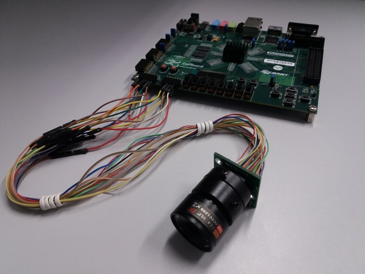

# ZedBoard Camera

A camera for the ZedBoard with the MT9D111 sensor.

<p align="center">

</p>

## Hardware

* [ZedBoard](http://zedboard.org/product/zedboard) development kit
* [MT9D111](http://www.arducam.com/camera-modules/camera-breakout-board/2mp-mt9d111/) image sensor

### Pin Map

#### PMOD Connector Reference

```
JA/JB

-------------------------------
| 6  | 5  | 4  | 3  | 2  | 1  |
-------------------------------
| 12 | 11 | 10 | 9  | 8  | 7  |
-------------------------------
```

#### Pin Reference Table

| *Pin Name*       | *ArduCam Pin* | *Zynq Pin* | *ZedBoard Pin*    |
|:-----------------|--------------:|-----------:|------------------:|
| 3.3 V            |           VCC |          - | JA6/JA12/JB6/JB12 |
| Ground           |           GND |          - | JA5/JA11/JB5/JB11 |
| I2C Serial Data  |           SDA |        AB9 |               JA9 |
| I2C Serial Clock |           SCL |        AA8 |              JA10 |
| HSYNC            |            HS |       AB10 |               JA8 |
| VSYNC            |            VS |        AA9 |               JA4 |
| Xtal Clock       |          XCLK |        Y10 |               JA3 |
| Pixel Clock      |          PCLK |       AB11 |               JA7 |
| Data 7           |            D7 |         V8 |              JB10 |
| Data 6           |            D6 |         V9 |               JB9 |
| Data 5           |            D5 |        W10 |               JB8 |
| Data 4           |            D4 |        V12 |               JB7 |
| Data 3           |            D3 |         W8 |               JB4 |
| Data 2           |            D2 |        V10 |               JB3 |
| Data 1           |            D1 |        W11 |               JB2 |
| Data 0           |            D0 |        W12 |               JB1 |
| Standby          |           STB |        Y11 |               JA1 |
| Reset            |           RST |       AA11 |               JA2 |

> **NOTE 1**: Xtal Clock (XCLK) = 10 MHz

> **NOTE 2**: I2C pins with pull-up enabled.

## Software

* I2C device: ```/dev/i2c-0```
* Image address: ```0x43C00000```
* Reset pin address: ```0x41200000```
* Standby pin address: ```0x41210000```
